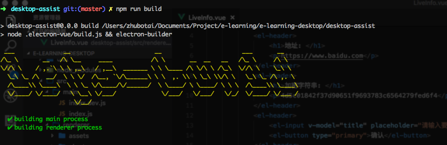
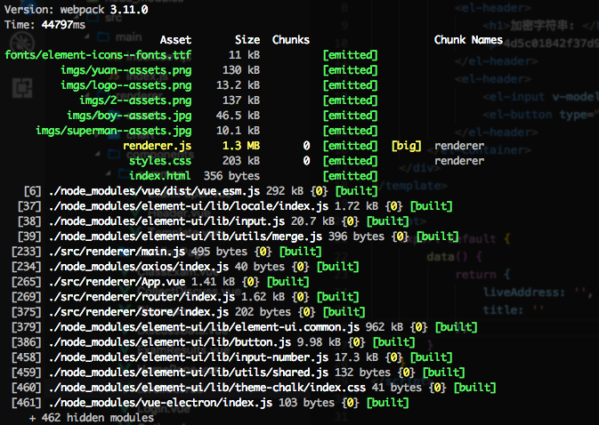
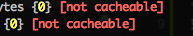

# e-learning-desktop

教师桌面端直播辅助工具

### 记一次踩坑小结
* electron-vue 打包后运行可执行文件白屏.执行npm run build 看打印信息

如果其中出现

如图,not cahcheable的字样,需要去找配置文件,在 .electron-vue/webpack.renderer.config.js 里面

将出现 not cahcheable 的插件或库的名称写进去,加到白名单就ok了

